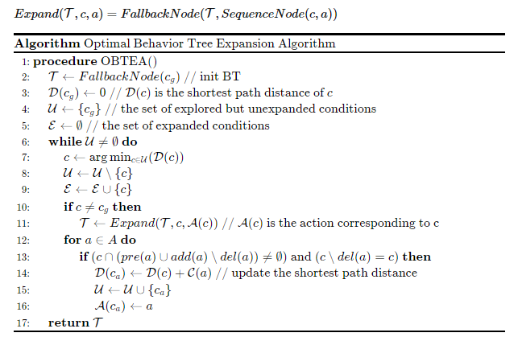

## Explanation of the code

### 1. `BehaviorTree.py`  - Implementation of Definitions for Behavior Tree Leaf Nodes and Non-Leaf Nodes

- **Leaf **：Represents a leaf node, which can be an action(`act`) or a condition(`cond`)。
- **ControlBT**：Represents a behavior tree that may contain control nodes. These control nodes can be selectors(`?`), sequences(`>`), action nodes(`act`)or condition nodes(`cond`)。
- Both classes contain a `tick` method.

### 2.  `BTExpansionAlgorithm.py` Implementation of the Optimal Behavior Tree Expansion Algorithm



Usage Instructions


### 3. **`tools.py`**  Implementation of Modules for Printing Data and Behavior Tree Testing

Usage Instructions

```python
print_action_data_table(goal,start,actions) # Print All Variables

# Behavior Tree Robustness Testing - Random Generation of Planning Problems
# Setting Hyperparameters for Generating Planning Problem Sets: Word Count, Solution Depth, Iteration Count
seed=1
literals_num=10
depth = 10
iters= 10
BTTest(seed=seed,literals_num=literals_num,depth=depth,iters=iters)
```

### 4. `Example.py` Designing Planning Scenarios

```python
def MoveBtoB ():
    actions=[]
    a = Action(name="Move(b,ab)") 
    a.pre={'Free(ab)','WayClear'}  
    a.add={'At(b,ab)'} 
    a.del_set= {'Free(ab)','At(b,pb)'}         
    a.cost = 1
    actions.append(a)

    a=Action(name="Move(s,ab)") 
    a.pre={'Free(ab)'} 
    a.add={'Free(ab)','WayClear'} 
    a.del_set={'Free(ab)','At(s,ps)'}  
    a.cost = 1
    actions.append(a)

    a=Action(name="Move(s,as)")
    a.pre={'Free(as)'} 
    a.add={'At(s,ps)','WayClear'} 
    a.del_set={'Free(as)','At(s,ps)'} 
    a.cost = 1
    actions.append(a)

    start = {'Free(ab)','Free(as)','At(b,pb)','At(s,ps)'} 
    goal= {'At(b,ab)'} 
    return goal,start,actions
```

### 5. `main.py` Implementing the Entire Workflow for Planning Generation, Behavior Tree Generation, Behavior Tree Execution, and Behavior Tree Testing
